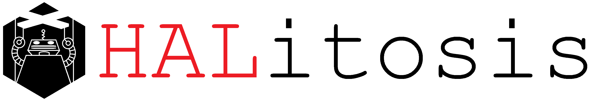

# HALitosis Attack Framework

> HALitosis is a framework for machine learning attacks

Machine Learning algorithms are used to make state of the art predictions from large, complicated datasets - however, their complexity create vulnerabilities that allow a saavy attacker to install backdoors that when triggered can create specific outputs that can even contain their own logic.

HALitosis is a [Python](https://www.python.org/) library that catalogues and categorizes these various methods of attack for ML algorithms written in [Tensorflow](https://www.tensorflow.org/), these include:

- Data Poisoning
- Training Poisoning
- RNG Bias Poisoning
- Backdoor Injection
- Meet-in-the-Middle Backdoors

## Getting Started

